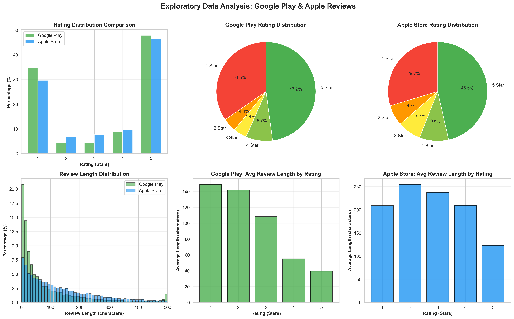

# EDA

1. average rating Google: 3.31/5 Apple: 3.36/5
2. Rating distributions are similar across both platforms, with reviews clustering heavily at 1-star and 5-star ratings (together accounting for roughly 80% of reviews on each platform).
3. average review length Google: 86 characters Apple: 174 characters
4. Review length patterns differ interestingly between platforms. On Google Play, negative reviews tend to be substantially longer while positive reviews are quite short (~35 characters). Apple Store reviews are generally longer overall, and 2-star reviews are actually the longest at around 260 characters.

## Visualizations



# Data Quality

---

## Executive Summary

Both datasets show strong structural integrity with no critical data quality issues that would block downstream use. Core fields (review ID, text, rating, date) are complete across both platforms. The main considerations for preprocessing relate to duplicate content, schema normalization, and handling optional fields like app version and developer replies.

## 1. Field Completeness

### Apple App Store

| Field       | Missing | % Missing |
| ----------- | ------- | --------- |
| review_id   | 0       | 0.00%     |
| author      | 0       | 0.00%     |
| title       | 0       | 0.00%     |
| text        | 0       | 0.00%     |
| rating      | 0       | 0.00%     |
| created_at  | 0       | 0.00%     |
| app_version | 57      | 0.29%     |

**Assessment:** Excellent completeness. The 0.29% missing app versions are negligible and can be handled with null values in the schema.

### Google Play

| Field        | Missing | % Missing |
| ------------ | ------- | --------- |
| reviewId     | 0       | 0.00%     |
| userName     | 0       | 0.00%     |
| content      | 0       | 0.00%     |
| score        | 0       | 0.00%     |
| at           | 0       | 0.00%     |
| appVersion   | 1,299   | 12.99%    |
| replyContent | 9,996   | 99.96%    |
| repliedAt    | 9,996   | 99.96%    |

**Assessment:** Core fields are complete. The 13% missing app versions is notable but acceptable. Reply fields are structurally empty (only 4 reviews have developer replies), which reflects platform behavior rather than data quality issues.

---

## 2. Duplicate Analysis

| Metric                 | Apple       | Google         |
| ---------------------- | ----------- | -------------- |
| Duplicate review IDs   | 0 (0.00%)   | 0 (0.00%)      |
| Duplicate text content | 955 (4.78%) | 1,744 (17.44%) |

### Observations

- **No duplicate IDs** — Each review has a unique identifier on both platforms.
- **Content duplicates are higher on Google Play (17.4%)** — This likely reflects user behavior (e.g., users posting the same review across multiple apps, or copy-paste reviews). These are not data errors but may warrant deduplication depending on modeling goals.
- **Apple's 4.8% duplicate rate** is within normal range for user-generated content.

---

## 3. Text Quality

| Metric                | Apple           | Google         |
| --------------------- | --------------- | -------------- |
| Empty/whitespace-only | 0 (0.00%)       | 0 (0.00%)      |
| Min length (chars)    | 1               | 1              |
| Max length (chars)    | 4,346           | 500            |
| Avg length (chars)    | 174.4           | 86.3           |
| Non-ASCII characters  | 10,444 (52.22%) | 1,050 (10.50%) |
| Encoding issues       | 0 (0.00%)       | 0 (0.00%)      |

### Observations

- **No empty reviews** — All records contain text content.
- **Google Play has a 500-character cap** — This is a platform constraint, not a data issue.
- **High non-ASCII rate on Apple (52%)** — Likely due to emojis, international characters, or special punctuation. No encoding errors detected, so these are valid UTF-8 characters.

---

## 4. Date Consistency

| Metric        | Apple     | Google    |
| ------------- | --------- | --------- |
| Format        | ISO8601   | ISO8601   |
| Invalid dates | 0 (0.00%) | 0 (0.00%) |

**Assessment:** Dates are fully consistent and parseable.

---

## 5. Schema Normalization Considerations

The two platforms have different field structures that will need alignment for a unified database:

| Concept         | Apple Field   | Google Field    | Notes                      |
| --------------- | ------------- | --------------- | -------------------------- |
| Review ID       | `review_id`   | `reviewId`      | Direct mapping             |
| Author          | `author`      | `userName`      | Direct mapping             |
| Review text     | `text`        | `content`       | Direct mapping             |
| Rating          | `rating`      | `score`         | Direct mapping (1-5 scale) |
| Date            | `created_at`  | `at`            | Both ISO8601               |
| App version     | `app_version` | `appVersion`    | Both nullable              |
| Title           | `title`       | —               | Apple only                 |
| Thumbs up       | —             | `thumbsUpCount` | Google only                |
| Developer reply | —             | `replyContent`  | Google only                |

---

# ERD

```
┌─────────────────────┐       ┌─────────────────────┐
│     platforms       │       │        apps         │
├─────────────────────┤       ├─────────────────────┤
│ PK  platform_id     │◄──┐   │ PK  app_id          │
│     name            │   │   │ FK  platform_id     │──┐
│     display_name    │   │   │     app_name        │  │
│     created_at      │   │   │     bundle_id       │  │
└─────────────────────┘   │   │     category        │  │
                          │   │     created_at      │  │
                          │   └─────────────────────┘  │
                          │                            │
                          │                            │
                          │   ┌─────────────────────┐  │
                          │   │      reviews        │  │
                          │   ├─────────────────────┤  │
                          │   │ PK  review_id       │  │
                          └───│ FK  platform_id     │  │
                              │ FK  app_id          │◄─┘
                              │     source_review_id│
                              │     author_name     │
                              │     title           │  ← Apple only
                              │     content         │
                              │     rating          │
                              │     app_version     │
                              │     review_date     │
                              │     thumbs_up_count │  ← Google only
                              │     developer_reply │  ← Google only
                              │     developer_reply_date │
                              │     ingested_at     │
                              │     is_duplicate    │
                              │     sentiment_label │  ┐
                              │     labeled_at      │  ├─ ML fields
                              │     labeled_by      │  ┘
                              └─────────────────────┘
```

---

## Table Summary

| Table       | Purpose                          | Key Fields                               |
| ----------- | -------------------------------- | ---------------------------------------- |
| `platforms` | Reference table for data sources | name, display_name                       |
| `apps`      | App metadata                     | app_name, bundle_id, category            |
| `reviews`   | Unified review data              | content, rating, review_date + ML fields |

# Pipeline Building

## Architecture

The pipeline follows a three-stage architecture:

```
┌─────────────┐      ┌─────────────┐      ┌─────────────┐
│   FETCH     │ ───▶ │  TRANSFORM  │ ───▶ │    LOAD     │
└─────────────┘      └─────────────┘      └─────────────┘
      │                     │                     │
      ▼                     ▼                     ▼
  Raw JSON          Normalized JSON        SQLite Database
```

Detailed information can be found in pipeline_architecture.md

# Monitoring

Detailed information can be found in pipeline_architecture.md

# Summary

This project implements a production-ready ETL pipeline for ingesting mobile app reviews from Google Play Store and Apple App Store. The pipeline demonstrates:

## Key Achievements

### 1. Dual-Platform Data Ingestion

### 2. Robust Data Pipeline

- **Three-stage architecture:** Fetch → Transform → Load
- **Data normalization:** Unified schema for heterogeneous sources
- **Quality assurance:** Validation, deduplication, error handling
- **Resume capability:** Incremental fetching for Apple reviews
- **Configurable scheduling:** Hourly to daily execution options

### 3. Production-Grade Monitoring

- **Comprehensive metrics:** Execution timing, data quality, error rates
- **Automated reporting:** Post-run monitoring reports
- **Alerting system:** Configurable thresholds for anomaly detection
